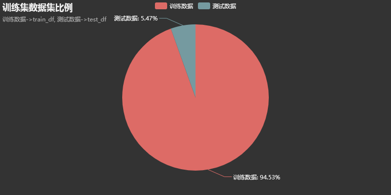
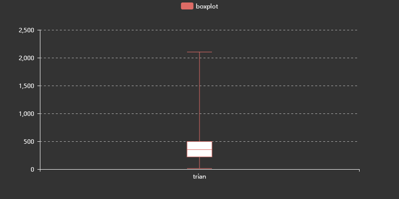
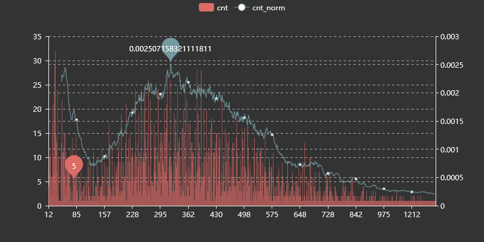
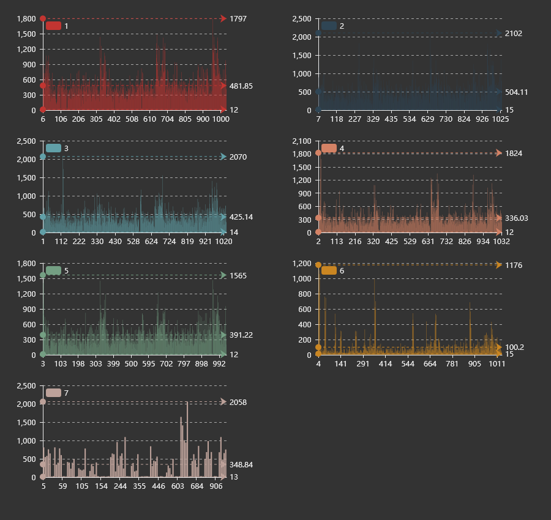
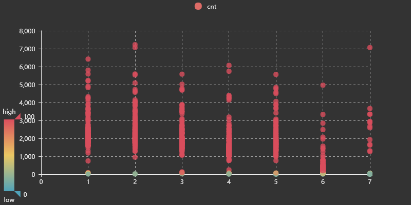
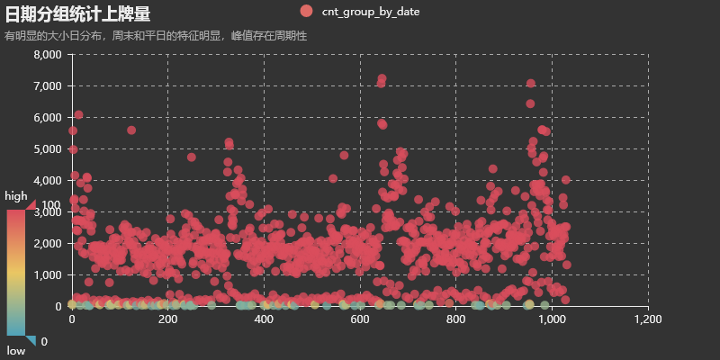
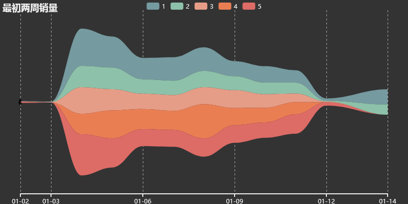

### 1. 题目说明

本次赛题需要选手利用历史某3年的汽车日上牌数据，预测某2年每天的汽车上牌数。初赛将挑选出5个汽车品牌，给出这些品牌每天的上牌数，当天是星期几，来预测5个汽车品牌未来每天的上牌总数。复赛将挑选出10个汽车品牌，仍旧给出品牌每天的上牌数，当天是星期几，来预测10个汽车品牌未来每天的上牌数。

| date        | int  | 日期，经过脱敏，用数字来表示 |
| :---------- | ---- | ---------------------------- |
| day_of_week | int  | 表示星期几                   |
| brand       | int  | 汽车品牌                     |
| cnt         | int  | 上牌数                       |

~~初赛提交结果要求~~

选手需要提交测试数据的预测结果，共2列：

| date | int  | 日期     |
| ---- | ---- | -------- |
| cnt  | int  | 上牌总数 |

**复赛提交结果要求** 

 选手需要提交测试数据的预测结果，共3列： 

| date  | int  | 日期     |
| ----- | ---- | -------- |
| brand | int  | 品牌     |
| cnt   | int  | 上牌总数 |

### 2. 一些可视化
#### 2.1 数据分布



题目要求连续三年数据，预测某两年的数据



箱式图可以看出数据右偏



定量描述一下观察结果

```
count    4773.000000
mean      380.567358
std       252.720918
min        12.000000
25%       221.000000
50%       351.000000
75%       496.000000
max      2102.000000
```




按照星期分布作图，工作日和周末的分布有明显差异，周末可以标记为特征。





### 3. 数据来源
- 给的数据包含Date，brand，cnt，dayofweek，其中dayofweek不连续。
- 给三年数据，预测某两年数据，节假日数据
- 抓了部分天气数据
- 数据泄露
- 销量数据，隔壁比赛泄露的
 

### 4. 数据预处理
- 数据填充，上牌量为0的日期没有数据
- 以星期和假期特征，进行具体日期推算，20121231
- 异常值处理，2013522网上选号上线，两个品牌销量存在跳跃
- 数据清理，归一化，离散化

### 5. 特征工程

* 日期相关特征 : 
  * 年第几周，年第几天
  * 周几
  * 年份，月份，日
  * **工作日是否式调休工作日**这个比较重要，成绩直接带进复赛
  * 2015年9月3日抗战纪念日比较特殊，不是每年都有。
  * 标记节假日与工作日
  * 农历节日
* 统计特征
* 品牌分组

### 6. 特征选择
* 基于树模型的特征重要度排序，主要的几个特征固定，逐一加入特征，比较线下成绩。
* 年日，品牌，销量比较重要

### 7. 模型选择
XGboost
- 特征调优 : 网格搜索针对分组品牌找最优解
- 数据后处理，有部分数据有明显规律，但是模型没能处理到位，输出结果检查文件头

### 8. 模型评估
$$mse=\frac{1}{n}\sum_{i=1}^{N}{(y_i-\hat{y}_i)^2 }$$


